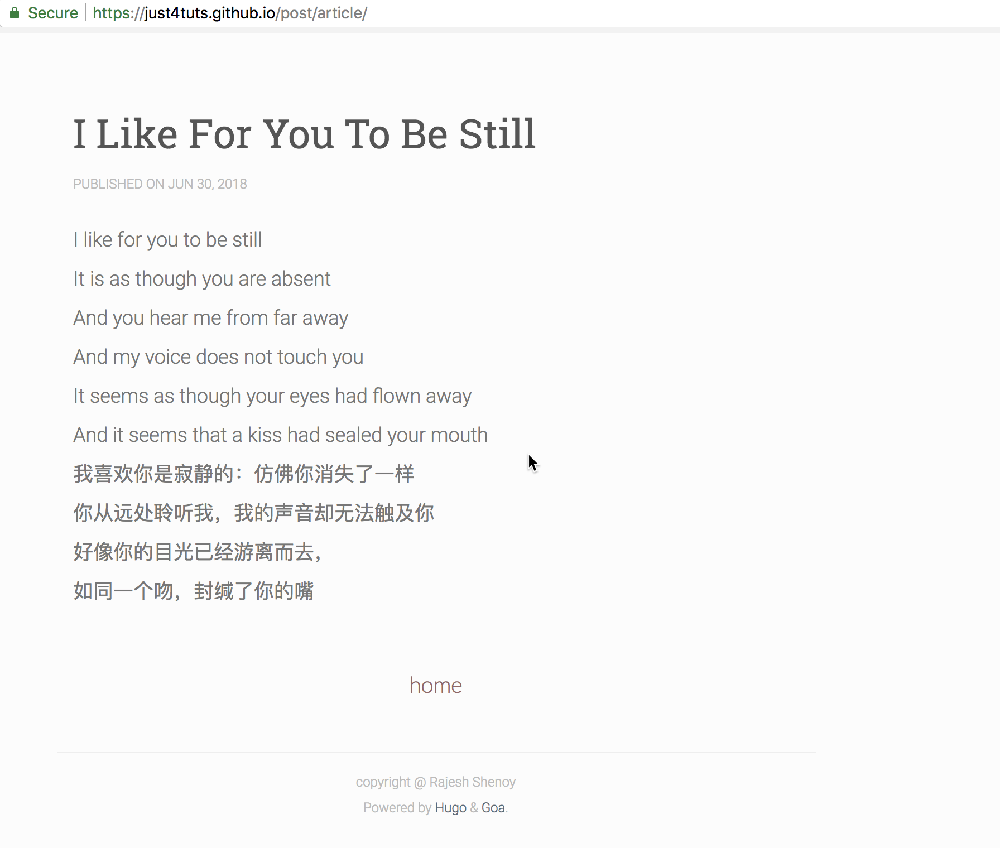

# hugo 简明教程

1. 安装 git

    首先要安装 git, 未安装的用户可以参考 [quick-vim-setup](https://github.com/ikey4u/quick-vim-setup),
    这个配置完成后, 连带 ssh 工具也配置了. SSH 目录, Linux  和 Mac 均为 `~/.ssh/` 而 Windows 为 `%USERPROFILE%\.ssh\`,
    如果没有则新建.

2. 生成 ssh 公钥,秘钥

    ```
    ssh-keygen -b 4096 -t rsa -C "ssh key for hugo" -f "~/.ssh/hugo_rsa"

    # Windows 用户如果上述命令失败, 可以尝试下面的命令.
    ssh-keygen -b 4096 -t rsa -C "ssh key for hugo" -f "%USERPROFILE%\.ssh\hugo_rsa"
    ```

    passphrase 可以省略不写, 直接回车即可.
    这条命令会在 SSH 目录下生成 `hugo_rsa` 和 `hugo_rsa.pub` 两个文件.

3. 配置 ssh

    打开配置文件

    ```
    vim $HOME/.ssh/config

    # Windows
    # vim %USERPROFILE%\.ssh\config
    ```

    写入如下内容

    ```
    Host hugo
        HostName github.com
        User git
        IdentityFile ~/.ssh/hugo_rsa
    ```

    保存退出.

4. 申请 github 账号, 并配置 ssh 公钥

    申请完 github 账号后, 登录, 点击右上角个人图标, 选择 `Settings`,
    然后在左侧面板选择 `SSH and GPG keys` 栏, 点击 `New SSH key`,
    写入 `hugo_rsa.pub` 文件的内容即可.

5. 安装 hugo

    下载 [hugo](https://github.com/gohugoio/hugo/releases), 根据自己的系统选择相应的版本下载,
    任意解压到某个目录, 并将 hugo 二进制文件加入到环境变量, 这样可以在任何路径执行 `hugo` 命令.

6. 新建仓库
    
    假设你申请的 github 用户名为 `just4tuts`, 执行以下操作.

    - 新建第一个仓库
    
        仓库名称为 hugoblog, 新建完成后, 会初始化生成一个 `Quick Setup` 页面,
        告诉你你可以通过 `SSH` 或者 `HTTPS` 的方式来使用仓库, 我们选择 `SSH`.
        比如 just4tuts 用户生成的为

        ```
        git@github.com:just4tuts/hugoblog.git
        ```

        将 `git@github.com` 替换为 `hugo` (这个 hugo 就是我们配置 SSH 时指定的 `Host` 的值),
        在任一目录打开命令行, 我们就得到了远程分支的 SSH 地址 `hugo:just4tuts/hugoblog.git`,
        稍后我们将会用到这个地址.

    - 新建第二个仓库, 名称为 just4tuts.github.io
    
        类似的第二个仓库我们得到的是

        ```
        git@github.com:just4tuts/just4tuts.github.io.git
        ```

        同样的方法, 我们得到第二个 SSH 地址为 `hugo:just4tuts/just4tuts.github.io.git`.
    
7. 博客初始化

    在任一目录打开终端, 执行如下命令新建一个站点 hugoblog 并进入该站点

    ```
    hugo new site hugoblog
    cd hugoblog
    ```

    初始化 git 本地仓库并关联远程 github 仓库, 客官不要急于开启 copy & paste大法,
    下面命令中的 `<name>` 和 `<email>` 要替换为你自己的名称和邮箱,
    以及 just4tuts 等都要替换成你自己的.

    ```
    git init
    git config --local user.name <name>
    git config --local user.email <email>
    git config --global core.quotepath false
    git remote add origin hugo:just4tuts/hugoblog.git
    git submodule add hugo:just4tuts/just4tuts.github.io.git public
    git add .
    git commit -m "blog init setup"
    git push origin master
    ```

    然后进入到 `hugoblog` 中的 `public` 目录, 执行如下操作

    ```
    git config --local user.name <name>
    git config --local user.email <email>
    ```

    为了自动化部署, 下载 [deploy.sh](https://raw.githubusercontent.com/ikey4u/hugo-guide/master/deploy.sh) 到 hugoblog.

    ```
    curl https://raw.githubusercontent.com/ikey4u/hugo-guide/master/deploy.sh -o deploy.sh
    ```

8. 博客主题

    到 [这里](https://themes.gohugo.io/) 选择一个心仪的对象,
    比如这款 [hugo-goa](https://shenoybr.github.io/hugo-goa-demo/).
    这里将以此主题为例, 演示如何安装主题(在该主题的 [介绍页面](https://themes.gohugo.io/hugo-goa/) 有说明).

    进入 hugoblog 目录, 执行下面的命令:

    ```
    cd themes
    git clone https://github.com/shenoybr/hugo-goa

    ```

    然后配置博客, 下载样例 config-example.toml 以及用到图片 mg.jpg,
    在 `hugoblog` 目录中执行如下命令完成操作

    ```
    curl https://raw.githubusercontent.com/ikey4u/hugo-guide/master/config-example.toml -o config.toml
    mkdir -p static/img
    curl https://raw.githubusercontent.com/ikey4u/hugo-guide/master/mg.jpg -o static/img/mg.jpg
    ```
    
    hugo 站点的当前配置可以通过 `hugo config` 来查看.

9. 写第一篇文章

    进入到 `hugoblog`, 执行如下命令

    ```
    hugo new post/article.md
    ```

    这个文件位于 `hugoblog/content/post/` 中, 博客中的图片可以放到 static 目录中,
    比如 static 下面放入一个 xxx.png,
    那么在 article.md 中可以用 ![img-title] (/xxx.png) 引用.

    在 article.md 中写入如下内容:

    ```
    ---
    title: "I Like For You To Be Still"
    date: 2018-06-30
    draft: false
    ---

    I like for you to be still
    
    It is as though you are absent
    
    And you hear me from far away

    And my voice does not touch you

    It seems as though your eyes had flown away

    And it seems that a kiss had sealed your mouth

    我喜欢你是寂静的：仿佛你消失了一样
    
    你从远处聆听我，我的声音却无法触及你
    
    好像你的目光已经游离而去，
    
    如同一个吻，封缄了你的嘴
    ```

10. 发表文章

    进入到 `hugoblog` 目录,  windows 用户执行如下命令

    ```
    bash deploy.sh
    ```

    Linux 和 mac 用户执行如下命令

    ```
    ./deploy.sh
    ```
11. 纸上得来终觉浅, 绝知此事要躬行

    看一下具体效果
    
    

    
