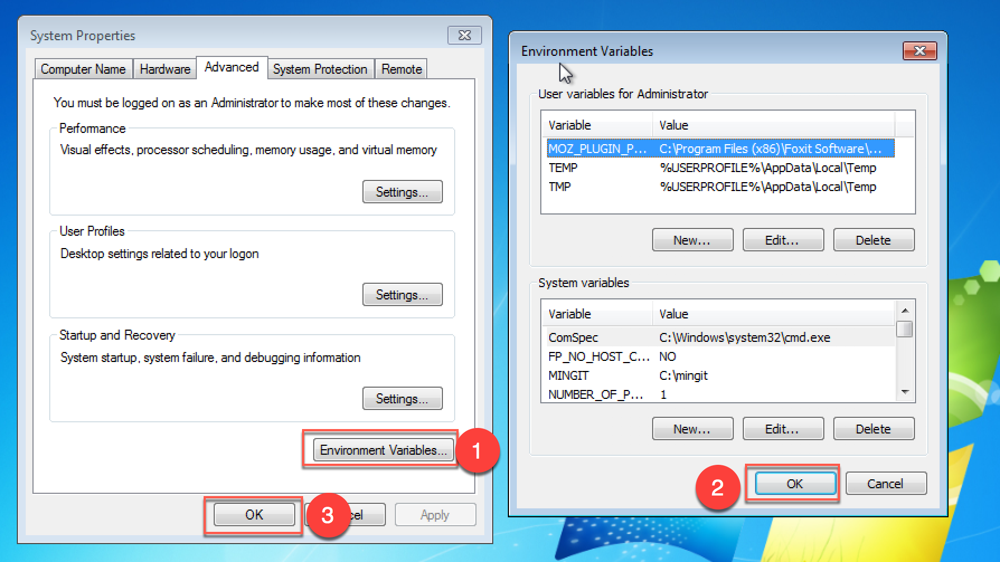

# For Windows User

## Install git (If you have installed git, remove it first, please)

- Download git directly from [Portable Git](https://github.com/git-for-windows/git/releases/download/v2.18.0.windows.1/PortableGit-2.18.0-64-bit.7z.exe)
and install it to C:\git. Ensure that `cmd/, etc/, mingw64/, usr/ ...`  are inside C:\git.

- Add the fucking windows environments.

    Open a cmd with administrator privilege and run the following commands:

    ```
    wmic environment create UserName="<system>",name="GIT",VariableValue="C:\git"
    wmic environment where 'UserName="<system>" and name = "Path"' set VariableValue="%PATH%;%GIT%\mingw64\bin;%GIT%\usr\bin;"
    mkdir %USERPROFILE%\.ssh
    sysdm.cpl
    ```

    Unfortunately, there is no effective way to refresh windows environment
    variables through command line, so I have to bother you to do something showed in
    the following figure in System Properties window:

    

    Note that here I help you create a ssh directory for your convenience.

    Now you should check if commands such as `git, ssh, ssh-keygen, curl, file,
    find, awk, gpg, grep, sed, scp ...` will work. If windows says something
    like `XXX is not recognized as an internal or external command`, then you
    should go back and recheck if you have missed somthing.

    Good luck, the fucking windows.

